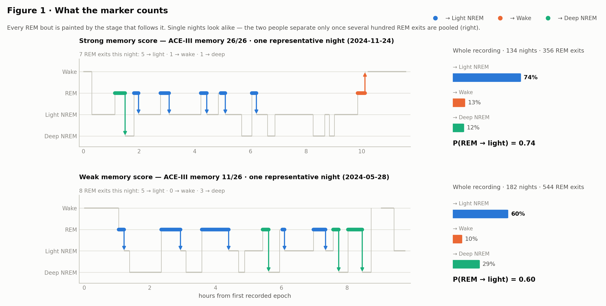

# REM-exit continuity: a stage-transition marker of memory in older adults

Code and notebook for the analysis of **where REM sleep goes when it ends**, and whether that
tracks cognition, in 73 community-dwelling older adults monitored at home for roughly six months.

The marker is the **REM-exit continuity index**, `P(REM -> light NREM)`: the share of REM episode
terminations that hand off to light NREM sleep rather than to wake or deep NREM.



## Main result

In 52 participants contributing 6,740 scored nights and 19,500 REM episode terminations, the index
tracked the ACE-III memory subscale (beta = +0.49 SD per SD, 95% CI 0.23-0.75, p = 0.0004;
FDR q = 0.005 across all twelve stage transitions). It was the only one of the twelve transitions to
survive correction, behaved as a stable trait (split-half 0.87, six-month test-retest r = 0.77), and
survived adjustment for mood, comorbidity and every conventional sleep metric computed from the same
nights.

It is also close to uninformative from a single night, and needs two to four weeks of recording
before it stabilises, which is the practical point of the whole analysis.

This is an **exploratory, hypothesis-generating** analysis. The marker was found by searching this
dataset, not specified in advance, and it has not been replicated in an independent cohort.

## Data

The recordings are not in this repository. They are the public RESILIENT *AD and Sleep* dataset:
<https://www.kaggle.com/datasets/alisaremi/ad-and-sleep>

## Reproducing

```bash
pip install numpy pandas scipy statsmodels scikit-learn matplotlib

# regenerate the notebook from its generator, then run every code cell as a script
python src/make_rem_notebook_v2.py --script
MPLBACKEND=Agg python kaggle_nb_rem_v2/_validate.py
```

The generator is the source of truth: `notebook/rem-exit-continuity-visual.ipynb` is built from
`src/make_rem_notebook_v2.py`, so edit the generator rather than the notebook. A full run takes
about ten minutes (the permutation tests and the nights-needed resampling dominate) and writes all
thirteen figures plus eight result tables.

Set `FIGURE_TITLES=0` to drop the in-figure title block, which is how the manuscript's figures are
produced (there the LaTeX caption carries the title instead).

`src/validate_palette.py` is a standalone check on the figure palette: it verifies the categorical
colours clear the colour-vision-deficiency and contrast floors used throughout the figure set.

## Layout

```
notebook/   the published Kaggle notebook and its kernel metadata
src/        the notebook generator and the palette validator
figures/    rendered figures from the most recent run
```

## Licence

MIT, see `LICENSE`.
